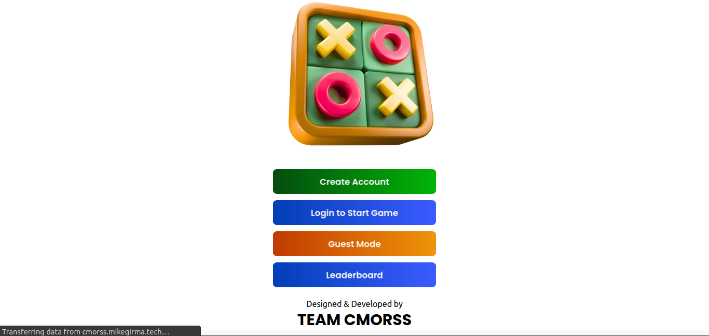
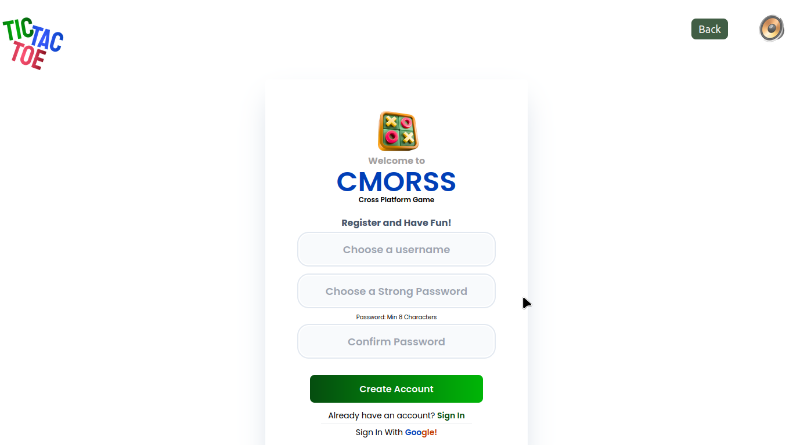
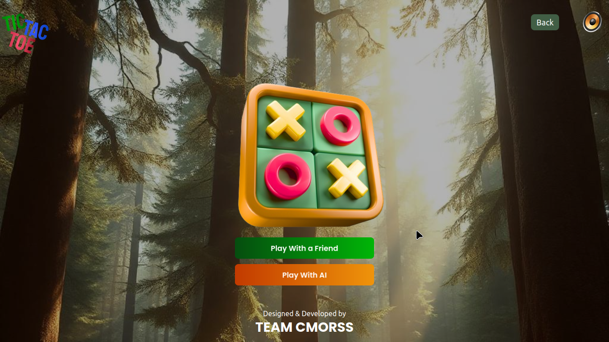
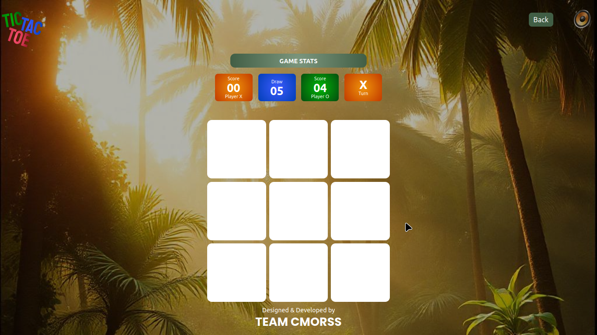
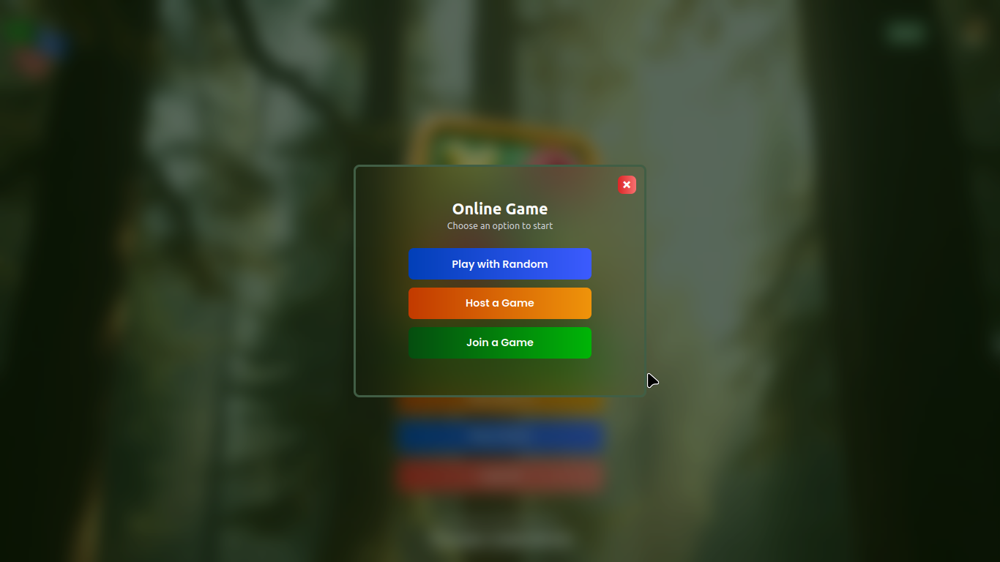
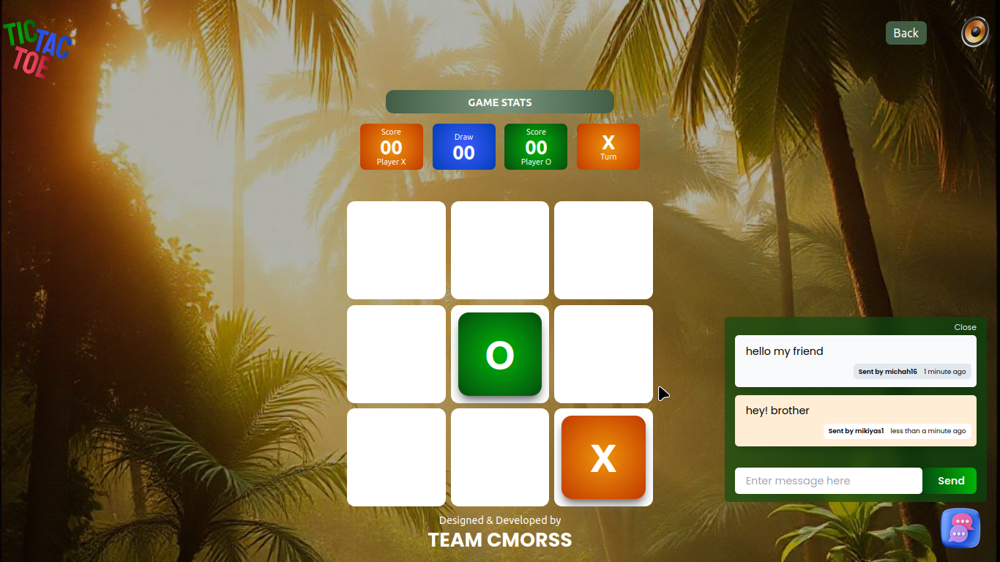
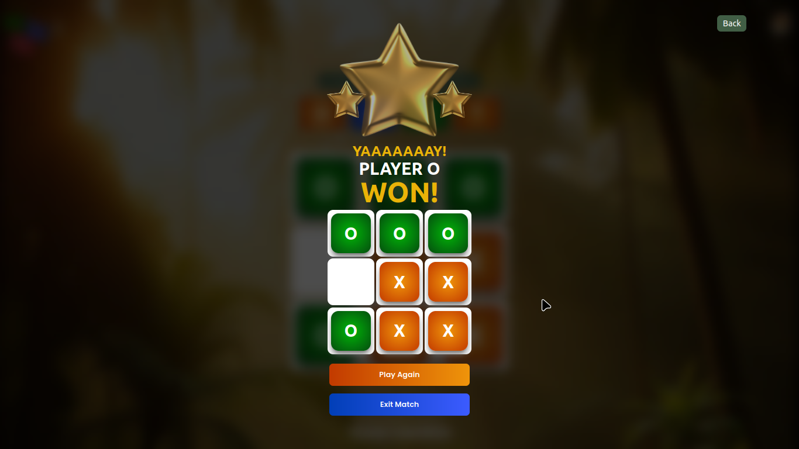

# CMORSS-Tic-Tac-Toe

## Project Description

CMORSS-Tic-Tac-Toe is a web-based Tic-Tac-Toe game developed as a submission for the qualification stage of the ALX SE Face-Off Cup. This project showcases a modern, feature-rich implementation of the classic game using the MERN stack (MongoDB, Express.js, React, Node.js), enhanced with TailwindCSS for styling and Socket.io for real-time multiplayer functionality.

This was a collaborative projects of Six Software Engineering Students of the ALX Fullstack Software Engineering Programme, coming from different Cohorts from C18 to C22.

## Team Members

- [Rayane](https://github.com/RyanTk03)
- [Stephen Omoregie](https://github.com/Cre8steveDev)
- [Mikiyas Girma](https://github.com/mikiyas-girma)
- [Houssem Eddine](https://github.com/SeM2x)
- [Christadrian Madegwa](https://github.com/Prish20)
- [Onyango Ondigo](https://github.com/ondi20)

## Features

- Player vs AI mode
- Real-time multiplayer mode using Socket.io
- Client-side routing and authentication
- State management for user preferences
- Responsive design for mobile and desktop

## Tech Stack

- Frontend: React.js with TypeScript
- Backend: Node.js with Express.js with Typescript
- Database: MongoDB
- Real-time Communication: Socket.io
- Styling: TailwindCSS
- Build Tool: Vite
- Version Control: Git & GitHub
- Web Server: Nginx

## Getting Started

### Prerequisites

- Node.js (v14 or later)
- MongoDB
- npm or yarn

## Project Structure

```
CMORSS-Tic-Tac-Toe/
│
├── frontend/                 # Frontend React application
│   ├── src/
│   │   ├── components/     # Reusable React components
│   │   ├── context/        # React context for state management
│   │   ├── pages/          # Page components
│   │   ├── hooks/          # Custom React hooks
│   │   ├── types/          # Type Definitions
│   │   ├── utils/          # Utility functions
│   │   ├── App.css
│   │   ├── App.tsx         # Main React component
│   │   ├── index.css
│   │   └── main.tsx        # Entry point for the application
│   │
│   ├── public/             # Public assets
│   └── vite.config.js      # Vite configuration
|   |__ .env                # environment variables
|   |__ package.json        # node.js frontend dependencies
│
├── backend/                 # Backend Node.js/Express application
│   ├── src/
│   │   ├── controllers/    # Request handlers
│   │   ├── models/         # Database models
│   │   ├── routes/         # API routes
│   │   ├── middleware/     # Custom middleware
│   │   └── app.js          # Express app setup
│   │
│   └── socket/             # Socket.io setup and event handlers
│   |__ .env                # Environment variables
|   |__ package.json        # Node.js dependencies for the backend
|
├── .gitignore
└── README.md
```


## Installations

### Setting up the frontend

1. **Clone the repository**:
   ```bash
   git clone https://github.com/RyanTk03/CMORSS-Tic-Tac-Toe.git
   cd CMORSS-Tic-Tac-Toe/frontend

2. **Install dependencies**:
   ```bash
   npm install
   ```
    or
    ```bash
    yarn install
    ```

3. **Setup environment variables**
- Create a .env file in the frontend directory with this content.
<br />
`VITE_SOCKET_SERVER="http://localhost:3000"` # if your backend is running on port 3000

4. **Start the development server**:
    ```bash
    npm run dev
    ```
     or
     ```bash
     yarn dev
     ```

5. **Open your browser** and navigate to `http://localhost:5173` to view the application.

6. **Build for production**
    ```bash
    npm run build
    ```
    or
    ```bash
    yarn build
    ```
7. **Serve the production build**
    ```
    npm run preview
    ```
    or
    ```
    yarn preview
    ```


### Setting up the backend

1. **Clone the repository**:
   ```bash
   git clone https://github.com/RyanTk03/CMORSS-Tic-Tac-Toe.git
    cd CMORSS-Tic-Tac-Toe/backend
    ```
2. **Install dependencies**:
    ```bash
    npm install
    ```
     or
     ```bash
     yarn install
     ```

3. **Setup Environment variables**
- create .env file in the backend directory with env variables that includes
<br />
`MONGODB ='your mongodb url'`
<br />
`JWT_SECRET = 'XXXXX'`
<br />
`PORT=3000`


3. **Start the development server**:
    ```bash
    npm run dev
    ```
     or
     ```bash
     yarn dev
     ```
4. **Open your browser** and navigate to `http://localhost:3000/api/hello` to check if the backend is running correctly.

5. **Build for production**
    ```bash
    npm run build
    ```
    or
    ```bash
    yarn build
    ```
6. **Serve the production build**
    ```
    npm run start
    ```


## Some Demo Images of the Project

### Home Page
<div style="display: flex; justify-content: center; padding-bottom: 10px">
  
</div>

### Signup Page
<div style="display: flex; justify-content: center; padding-bottom: 10px">
  
</div>

### Page with Guest mode
<div style="display: flex; justify-content: center; padding-bottom: 10px">
  
</div>

### Page with Game Board 
<div style="display: flex; justify-content: center; padding-bottom: 10px">
  
</div>

### Game Options Page
<div style="display: flex; justify-content: center; padding-bottom: 10px">
  
</div>

### In Game Chat Mode
<div style="display: flex; justify-content: center; padding-bottom: 10px">
  
</div>

### Result Page
<div style="display: flex; justify-content: center; padding-bottom: 10px">
  
</div>


## License

This project is licensed under the MIT License - see the [LICENSE](LICENSE) file for details.

## Acknowledgments

- ALX SE for organizing the Face-Off Cup
- The open-source community for the amazing tools and libraries used in this project

---
